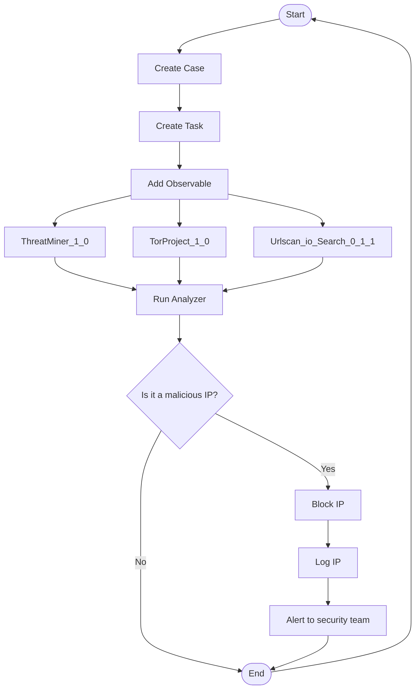

# Playbook
- 여러 단계로 구성된 자동화된 작업 흐름

### 1. 이벤트 대응
- Case, Task 생성

### 2. 플러그인 활용, 데이터 통합
- 탐지된 IP로 Observable 생성
- ThreatMiner, TorProject, Urlscan io Search를 이용해서 해당 IP에 대한 정보 탐색

### 3. 조건부 실행 유무
- 악성 IP로 판단되면 해당 IP를 차단

### 4. 모니터링 및 로깅
- 처리된 IP에 대한 내용을 로그에 기록

